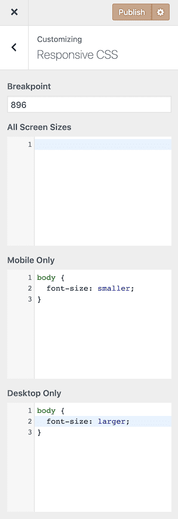

# Responsive CSS

This little plugin adds a new section to the Customizer which allows you to add CSS at different breakpoints without having to manually write media queries.

It creates the following custom CSS fields:

- All screen sizes
- Mobile only
- Desktop only

You can also change the breakpoint at which the mobile and desktop media queries change.

## Screenshot

## FAQ

### Will this plugin be added to WordPress.org?

Yes, at some stage it will.

### What is dynamic CSS?

By default, WordPress' Additional CSS is output as an inline style in the `<head>` section of your site. This isn't great as it can't be cached. Instead of doing that, this plugin uses dynamic CSS which is treated just like a CSS file.

### Can you add feature X?

Probably, create a new issue here and I'll consider adding your feature request.
